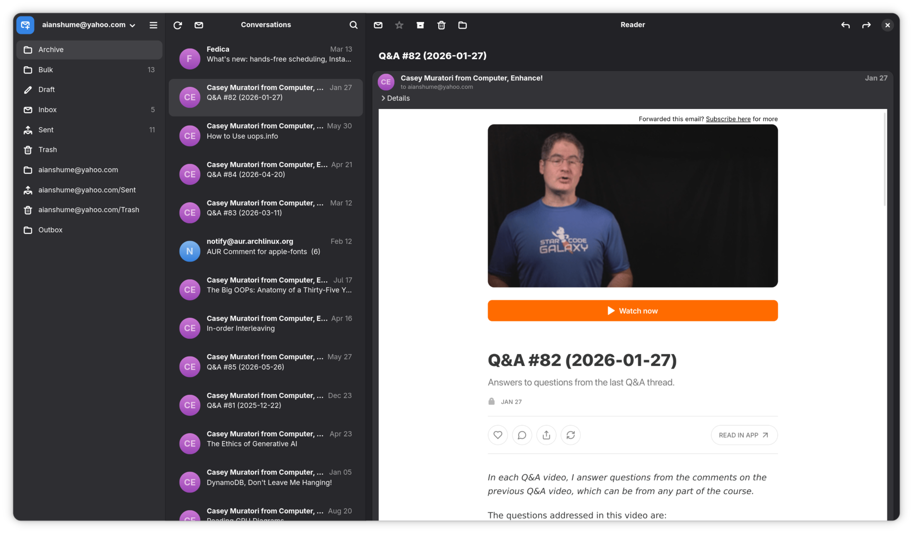

<div align="center">
  

  # Postcard

  A modern email client for GNOME.

  [](https://github.com/gxanshu/postcard/releases)
  [](COPYING)
</div>

Postcard started out as Geary's three-pane layout (folders, conversations, reading pane)
rebuilt on a modern stack: GTK 4, libadwaita, and Python. It's quickly growing into its own
alternative, with modern technology, a simple codebase, and a clean UI, minus the years of
accumulated complexity. It's built and shipped as a Flatpak.

<div align="center">
  
</div>

> **Heavy development.** Postcard is under active development and can have bugs or unexpected
> behavior. If you hit one, please [report it on the GitHub issues
> panel](https://github.com/gxanshu/postcard/issues). It helps a lot.

## Features

- Multiple IMAP/SMTP accounts, with passwords stored in the system keyring
- Conversations grouped into threads
- Instant full-text search across your mail
- Offline reading from a local cache
- HTML and plain-text mail, with remote images blocked until you allow them
- Compose, reply, and forward, with Cc/Bcc, a signature, and a Drafts/Outbox that never loses
  a message
- Archive, trash, move, and undo, with desktop notifications for new mail
- Many more are coming soon

## Installing

Postcard ships as a Flatpak from its own repository. You'll need `flatpak` installed on your
system (most GNOME distributions have it already; if not, see
[flatpak.org/setup](https://flatpak.org/setup/)).

Add the repository, install the app, then launch it:

```bash
flatpak remote-add --if-not-exists postcard https://postcard.gxanshu.in/postcard.flatpakrepo
flatpak install postcard in.gxanshu.postcard
flatpak run in.gxanshu.postcard
```

After the first install, Postcard shows up in your app launcher like any other application, and
`flatpak update` keeps it current.

## Building from source

If you'd rather build it yourself, Postcard is built and run entirely as a Flatpak, the same way
it ships to users. There is no host-level `python app.py`; everything goes through
[`just`](https://github.com/casey/just):

```bash
just init      # one-time: add Flathub, install the GNOME runtime + SDK
just build     # build the Flatpak from the working tree, install for --user
just run       # build, then launch (the normal dev loop)
```

This requires `flatpak` and `flatpak-builder` on the host. Python, GTK, and everything else
comes from the GNOME SDK.

## Tech stack

GTK 4, libadwaita, Blueprint (`.blp`) UI, WebKitGTK for HTML mail, SQLite (with FTS5 for
search), Python's stdlib `imaplib`/`smtplib` for networking, and libsecret for credentials.

## AI Notice

Postcard is written with the help of AI tools, and I'd rather be open about that than leave you
guessing.

The beauty of Linux is that everyone is free. You're welcome to your own opinions, and if you
don't share someone else's, you're just as free to go and build your own alternative. Much of
the Flathub and GNOME community is wary of AI, and I genuinely respect that view. I just happen
to see it differently. To me, AI is a tool like fire: put to good use, it's a wonderful thing.

I'm not interested in spending hours typing out code that's already fully formed in my head. So
I let AI do the typing. But every line in this codebase comes from my own head; AI takes the
place of my hands, never my judgment. And I would never recommend running AI on autopilot. You
have to stay in control of what it produces.

If any of this leaves you feeling the app is "AI slop", that's completely fair, and you're
welcome to reach for whichever client suits you best. But if you do choose to install Postcard,
I hope you'll trust it. It's built with the same care as anything written by hand.

## Contributing

Contributions are welcome. AI-assisted work is fine here (see the [AI Notice](#ai-notice)
above), but please make sure you understand every line you submit.

## License

[GPL-3.0-or-later](COPYING).
