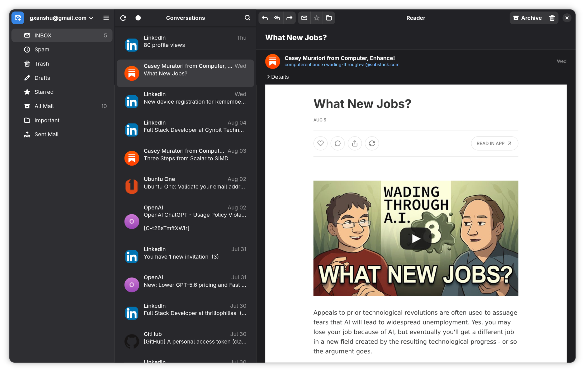
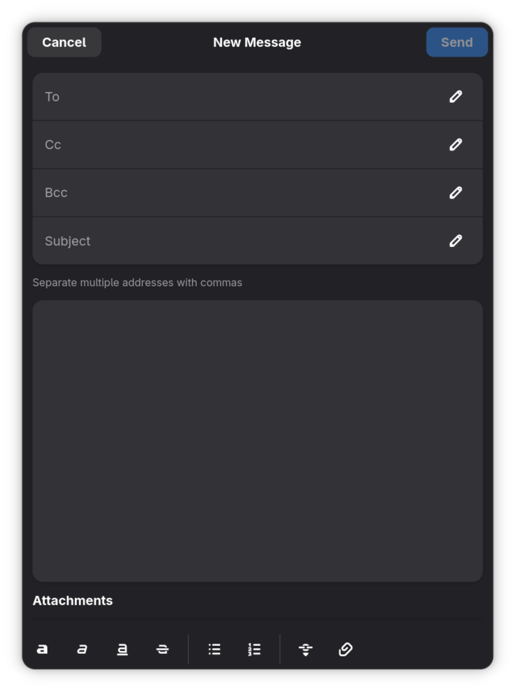
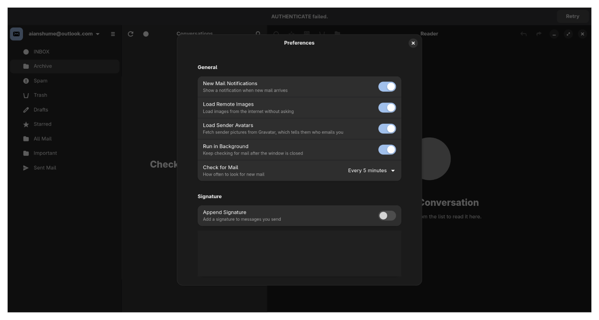
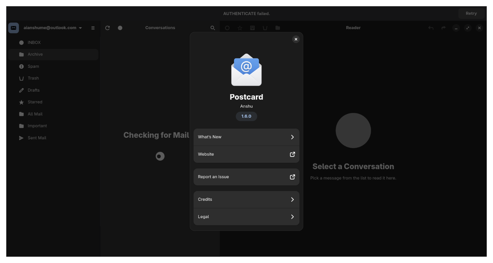

<div align="center">
  

  # Postcard

  **Geary's three-pane email, rebuilt on GTK 4 — without twelve years of accumulated complexity.**

  [](https://github.com/gxanshu/postcard/releases)
  [](https://github.com/gxanshu/postcard/actions/workflows/tests.yml)
  [](COPYING)
  [](#installing)
  [](https://github.com/gxanshu/postcard/stargazers)

  [**Install**](#installing) · [**Providers**](#supported-providers) · [**Features**](#features) · [**Roadmap**](#roadmap) · [**Build**](#building-from-source)
</div>

Postcard started out as Geary's three-pane layout (folders, conversations, reading pane)
rebuilt on a modern stack: GTK 4, libadwaita, and Python. It's quickly growing into its own
alternative, with modern technology, a simple codebase, and a clean UI, minus the years of
accumulated complexity. It's built and shipped as a Flatpak.

**No accounts, no telemetry, no cloud.** Your mail lives in a SQLite file on your machine and
your passwords live in the system keyring. Postcard talks to your mail server and nothing else.

<div align="center">
  
</div>

<table>
  <tr>
    <td width="33%"><br><sub><b>Composer</b> — rich text, and the layout adapts down to a phone-width window</sub></td>
    <td width="33%"><br><sub><b>Preferences</b> — notifications, remote images, background sync, signature</sub></td>
    <td width="33%"><br><sub><b>About</b> — plain libadwaita, no custom chrome</sub></td>
  </tr>
</table>

> **Heavy development.** Postcard is under active development and can have bugs or unexpected
> behavior. If you hit one, please [report it on the GitHub issues
> panel](https://github.com/gxanshu/postcard/issues). It helps a lot.

## Features

**📬 Mail**
- Multiple IMAP/SMTP accounts, with passwords stored in the system keyring and a TLS/STARTTLS
  choice per server (so Proton Mail Bridge works)
- Conversations grouped into threads, with nested folders shown as a tree
- Instant full-text search across your mail
- Offline reading from a local cache, and syncing that carries on in the background after you
  close the window

**✍️ Composing**
- Rich-text composer: bold, italic, underline, strikethrough, bulleted and numbered lists, and
  links — sent as HTML with a plain-text alternative
- Compose, reply, and forward, with Cc/Bcc, a signature, and a Drafts/Outbox that never loses
  a message
- Recipient autocomplete drawn from the addresses already in your mail

**🖥️ Desktop**
- HTML and plain-text mail, with remote images blocked until you allow them, and links opening
  in your default browser
- Archive, trash, move, and undo — one conversation or a whole selection at once — with
  desktop notifications for new mail
- Optional sender avatars from Gravatar, with the sender's site icon as a fallback
- Sets itself up as your default mail client, so `mailto:` links open the composer already
  filled in

…and many more are coming soon.

## Supported providers

Postcard talks plain IMAP and SMTP, so anything that speaks those works. **Works** means the
protocol is supported; **Tested** means it's been run against a real account.

| Provider | Works | Tested | Notes |
|---|:---:|:---:|---|
| **Gmail** | ✅ | ✅ | Needs 2-Step Verification + an [app password](https://myaccount.google.com/apppasswords) — your normal password won't authenticate |
| **Yahoo Mail** | ✅ | ✅ | Needs an app password from Account Security |
| **Proton Mail** | ✅ | ✅ | Through [Proton Mail Bridge](https://proton.me/mail/bridge) (paid plans); use the Bridge's local host, port, and generated password with STARTTLS |
| **Any IMAP/SMTP server** | ✅ | — | Fastmail, Zoho, Mailbox.org, self-hosted Dovecot/Postfix… enter the host, port, and TLS mode by hand |
| **Outlook / Hotmail / Microsoft 365** | ❌ | ❌ | Microsoft requires OAuth 2.0 and has retired basic auth. Support is planned and coming soon |

> **Tip:** most providers with 2FA won't accept your account password over IMAP. Generate an
> app-specific password and use that instead.

## Installing

Postcard ships as a Flatpak from its own repository. You'll need `flatpak` installed on your
system (most GNOME distributions have it already; if not, see
[flatpak.org/setup](https://flatpak.org/setup/)).

Add the repository, install the app, then launch it:

```bash
flatpak remote-add --if-not-exists postcard https://postcard.gxanshu.in/postcard.flatpakrepo
flatpak install postcard in.gxanshu.postcard
flatpak run in.gxanshu.postcard
```

After the first install, Postcard shows up in your app launcher like any other application, and
`flatpak update` keeps it current.

## Starting hidden at login

Turn on **Keep running in the background** in Preferences, then add this command to your desktop
environment's autostart (GNOME Tweaks → Startup Applications, or your DE's equivalent):

```bash
flatpak run in.gxanshu.postcard --hidden
```

GNOME Tweaks can only pick existing applications, so if it won't take the flag, drop the command
into `~/.config/autostart/in.gxanshu.postcard.desktop` instead:

```ini
[Desktop Entry]
Type=Application
Name=Postcard
Exec=flatpak run in.gxanshu.postcard --hidden
Icon=in.gxanshu.postcard
```

Postcard then starts with no window at login and just checks for new mail on your sync interval,
notifying you when something arrives. Click a notification or launch it from your app launcher to
open the window.

## Building from source

If you'd rather build it yourself, Postcard is built and run entirely as a Flatpak, the same way
it ships to users. There is no host-level `python app.py`; everything goes through
[`just`](https://github.com/casey/just):

```bash
just init      # one-time: add Flathub, install the GNOME runtime + SDK
just build     # build the Flatpak from the working tree, install for --user
just run       # build, then launch (the normal dev loop)
```

This requires `flatpak` and `flatpak-builder` on the host. Python, GTK, and everything else
comes from the GNOME SDK.

## Tech stack

GTK 4, libadwaita, Blueprint (`.blp`) UI, WebKitGTK for HTML mail, SQLite (with FTS5 for
search), Python's stdlib `imaplib`/`smtplib` for networking, and libsecret for credentials.

## AI Notice

Postcard is written with the help of AI tools. AI does the typing, the architecture, review, and the responsibility are mine. Every line was read before it shipped.

I'd rather you judge that claim against the repo than take my word for it:

- **175 tests** across the pure-logic layer — threading, MIME parsing, compose, the database,
  and the IMAP/SMTP sessions against a fake socket
- **CI runs them on every push**, and again before every release. A failing test blocks the
  build, not just the merge
- **`ruff` + `pyright` gate the Flatpak itself** — a lint or type error means the app doesn't
  build at all, so no "it typechecks later" drift
- **A documented architecture with real invariants** ([CLAUDE.md](CLAUDE.md)): a hard
  no-GTK-in-`core/` boundary, a strict worker-thread/`GLib.idle_add` threading model, and
  passwords that never touch the database or a log line
- **Zero third-party runtime dependencies.** Everything comes from the GNOME SDK; networking is
  stdlib `imaplib` and `smtplib`. There is no dependency pile to hide sloppiness in
- **GPL-3.0, under 7k lines** of Python and Blueprint. Small enough that you can read the whole
  thing and decide for yourself

<details>
<summary>Why I use AI, and why the app isn't on Flathub</summary>

<br>

The beauty of Linux is that everyone is free. Much of the Flathub and GNOME community is wary
of AI, and I genuinely respect that view — Flathub declined to list Postcard on those grounds,
which is why it ships from its own repository. I just happen to see it differently. To me, AI
is a tool like fire: put to good use, it's a wonderful thing.

I'm not interested in spending hours typing out code that's already fully formed in my head, so
I let AI do the typing. But I would never recommend running AI on autopilot. You have to stay
in control of what it produces, and the checks above exist because I don't trust it any further
than I'd trust myself at 2am.

If this still leaves you feeling the app is "AI slop", that's completely fair, and you're
welcome to reach for whichever client suits you best. But if you do install Postcard, I hope
you'll trust it. It's built with the same care as anything written by hand.

</details>

## Contributing

Contributions are welcome — bug reports especially, since Postcard is young and every real
inbox is different. Code contributions should pass `just check` and `just test`; AI-assisted
work is fine here (see the [AI Notice](#ai-notice) above), but please make sure you understand
every line you submit.

If Postcard is useful to you, a ⭐ genuinely helps other people find it.

## License

[GPL-3.0-or-later](COPYING).
