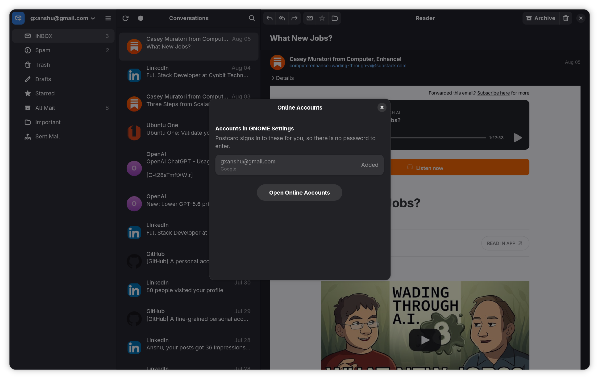

<div align="center">


# Postcard

**An email client for GNOME, written in Python with GTK 4 and libadwaita.**

[](#installing)
[](https://github.com/gxanshu/postcard/actions/workflows/tests.yml)
[](COPYING)
[](#installation)

[**Install**](#installation) · [**Providers**](#supported-providers) · [**Features**](#features) · [**Build**](#building-from-source)
</div>

Postcard has the classic three panel layout. folders on the left, conversations in the middle and the reading panel. Nothing fancy, just how an email client should look. It ships as a Flatpak and the whole codebase is small enough to read in an evening.

**There are no accounts, no telemetry, and no cloud**. Your mail is stored in a SQLite file on your machine and your passwords go into the system keyring. Postcard only talks to your mail server, nothing else.

<div align="center">

</div>

<table>
<tr>
<td width="50%"></td>
<td width="50%"></td>
</tr>
<tr>
<td align="center"><sub><b>Preferences</b></sub></td>
<td align="center"><sub><b>About</b></sub></td>
</tr>
</table>

<div align="center">


<sub><b>Composer</b></sub>
</div>

<div align="center">


<sub><b>Gnome Online Accounts Sync</b></sub>
</div>

> **Postcard is in heavy development.** You will probably hit bugs. Please
> [report them](https://github.com/gxanshu/postcard/issues), it helps me a lot.

## Features

### 📬 Mail

- **Google in one click.** If you already added your Google account in GNOME Settings under Online Accounts, just pick it in Postcard. It uses OAuth, so Postcard never sees your password.
- **Any IMAP/SMTP account**, as many as you want. Passwords are stored in the system keyring. You can choose TLS or STARTTLS for each server, so Proton Mail Bridge also works.
- **Server settings are filled in automatically** from your email address for Gmail, Yahoo, iCloud, Outlook, Fastmail, Zoho, AOL and Yandex. If you type something by hand, Postcard does not touch it.
- **Threaded conversations** and nested folders shown as a tree.
- **Full-text search** across all your mail.
- **Works offline** from the local cache, and keeps syncing after you close the window (optional)

### ✍️ Composing

- **Rich text**: bold, italic, underline, strikethrough, bulleted and numbered lists, links. Mail is sent as HTML with a plain-text version included.
- **Reply, reply-all and forward**, with Cc/Bcc, a signature, and a Drafts/Outbox that does not lose your message.
- **Recipient autocomplete** from the addresses already in your mail.

### 🖥️ Desktop

- **HTML and plain-text mail.** Remote images are blocked until you allow them, and links open in your browser.
- **Archive, trash, move, undo**, on one conversation or a whole selection.
- **Attachments** open in their default app with one click.
- **Relative dates** ("2h ago", "Yesterday"), with the exact time shown on hover.
- **Desktop notifications** when new mail arrives.
- **Sender avatars** from Gravatar, or the icon from the sender's website if there is no Gravatar. You can turn this off.
- **Default mail client**: `mailto:` links open the composer with the fields already filled.

More are coming.

## Supported providers

Postcard speaks plain IMAP and SMTP, so anything that supports those should work. "Works" means the protocol is supported. "Tested" means I actually ran it against a real account.

| Provider | Works | Tested | Notes |
|---|:---:|:---:|---|
| **Gmail** | ✅ | ✅ | The easiest way: add your Google account in GNOME Settings → Online Accounts, then pick it in Postcard. Adding it by hand also works, but you need 2-Step Verification and an [app password](https://myaccount.google.com/apppasswords) |
| **Yahoo Mail** | ✅ | ✅ | Needs an app password from Account Security |
| **Proton Mail** | ✅ | ✅ | Through [Proton Mail Bridge](https://proton.me/mail/bridge) (paid plans). Use the Bridge's local host, port and password with STARTTLS |
| **Any IMAP/SMTP server** | ✅ | ❌ | Fastmail, Zoho, Mailbox.org, Migadu (✅), self-hosted Dovecot/Postfix. Enter host, port and TLS mode by hand |
| **Outlook / Hotmail / Microsoft 365** | ❌ | ❌ | Microsoft removed basic auth and requires OAuth 2.0. Planned |

TIP: most providers with 2FA will reject your normal account password over IMAP. You need to generate an
app specific password instead. For Google, you can use Gnome Online Accounts but for password based login
you need app password.

Only OAuth accounts are imported from Online Accounts, which in practice means only Google at the moment. A GOA "Email Server" account is plain IMAP/SMTP which is already handled by Postcard. Microsoft 365 and Exchange give out Graph-only tokens with no IMAP access. [Microsoft support is in development](https://github.com/gxanshu/postcard/issues/18)

# Installation

You need `flatpak`. Most GNOME distros already have it, otherwise see [flatpak.org/setup](https://flatpak.org/setup/).

then run

```bash
flatpak install --from https://github.com/gxanshu/postcard/releases/latest/download/postcard.flatpakref
flatpak run in.gxanshu.postcard
```

If you prefer GUI for installation then download [`postcard.flatpakref`](https://github.com/gxanshu/postcard/releases/latest/download/postcard.flatpakref) and open it with your software centre.

After that Postcard shows up in your app launcher like any other app, and `flatpak update` keeps it current.

## Starting hidden at login

Turn on **Keep running in the background** and **Start at Login** in Preferences.
Postcard asks the desktop portal to create the autostart entry, so there is no
file to write by hand.

Postcard starts with no window, checks for mail on your sync interval, and notifies you when something arrives. Click the notification to open it.

## Building from source

Postcard builds and runs entirely as a Flatpak, the same way it ships. There is no host-level `python app.py`. Everything goes through [`just`](https://github.com/casey/just)

```bash
just init # one-time: add Flathub, install the GNOME runtime + SDK
just build # build from the working tree, install for --user
just run # build, then launch (the normal dev loop)
```

You only need `flatpak` and `flatpak-builder` on the host. Python, GTK and everything else come from the GNOME SDK.

For the curious: the UI is GTK 4 and libadwaita with Blueprint (`.blp`) files, HTML mail is rendered with WebKitGTK, search uses SQLite FTS5, networking is done with the Python standard library (`imaplib` and `smtplib`), and credentials go through libsecret.

## AI Notice

I write Postcard with the help of AI tools. The AI does the typing, but the architecture, the review and the responsibility are mine. I read every line before it ships.

The beauty of Linux is that everyone is free. A big part of the Flathub and GNOME community is wary of AI, and I respect that. Flathub declined to list Postcard for this reason, so it ships from its own repository instead. I simply see it differently, AI is a tool like fire. Used well, it is a wonderful thing.

I am not interested in spending hours typing out code that is already fully formed in my head, so I let the AI type it. But I would never recommend running it on autopilot. You have to stay in control of what it produces.

If this still feels as "AI slop" to you, that is fair, and you are welcome to use whatever client suits you. But if you do install Postcard, I hope you will trust it. It is built with the same care as anything written by hand.

## Contributing

Contributions are welcome, bug reports especially, because Postcard is young and every real inbox is different. Code should pass `just check` and `just test`. AI-assisted work is fine, as long as you understand every line you submit.

New here? [CONTRIBUTING.md](CONTRIBUTING.md) explains the dev environment. Either open the folder in [GNOME Builder](https://flathub.org/en/apps/org.gnome.Builder) and let it install the SDK it suggests, or run `just init` and `just run`.

If Postcard is useful to you, a ⭐ helps other people find it.

## License

[GPL-3.0-or-later](COPYING).
